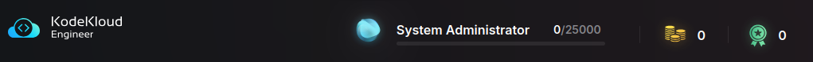
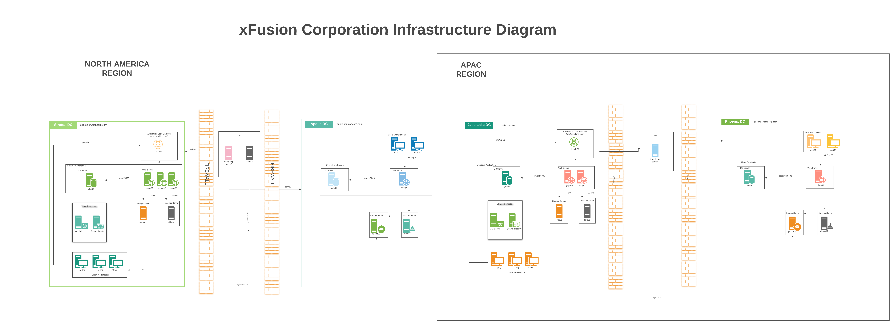

# KodeKloud_Engineer_Projects

KodeKloud Engineer is a FREE platform for IT Professionals to gain real hands-on experience working on trending IT technologies.

Hi everyone 🗺️

- This is my journey at KodeKloud Engineer.

## Ranking

- Update 10/11/2024: **System Administrator**

## About the platform

[KodeKloud Engineer](https://kodekloud-engineer.com/#!/project_brief) is a platform which provides hands-on training on Cloud and DevOps technologies such as Docker, Kubernetes, Ansible, Linux and others.

It puts you on the shoes of a newly-hired employee at a fictional company called **xFusion Corp**, assigned to a project in which you will have to complete tasks to earn points and practice the skills required for the job.

Initially, you are hired as a SysAdmin but, through accumulating points by completing tasks, you can move on to two other roles: DevOps Engineer and DevOps Architect, with increasingly complex assignments. These tasks are also divided in 3 difficulty categories: easy, medium and hard.

The company assigns you to the **Nautilus Marine** project, with the network infrastructure detailed [here](https://lucid.app/lucidchart/58e22de2-c446-4b49-ae0f-db79a3318e97/view?page=0_0#). Naturally, the employee will have to consult both the infrastructure diagram and more documentation in order to complete the tasls, especially the more complex they get, just as a real job.

## Project Nautilus Architecture

# SSH commands

| Service Name             | Command                     |
| ------------------------ | --------------------------- |
| Nautilus App 1           | `ssh tony@172.16.238.10`    |
| Nautilus App 2           | `ssh steve@172.16.238.11`   |
| Nautilus App 3           | `ssh banner@172.16.238.12`  |
| Nautilus HTTP LBR        | `ssh loki@172.16.238.14`    |
| Nautilus DB Server       | `ssh peter@172.16.239.10`   |
| Nautilus Storage Server  | `ssh natasha@172.16.238.15` |
| Nautilus Backup Server   | `ssh clint@172.16.238.16`   |
| Nautilus Mail Server     | `ssh groot@172.16.238.17`   |
| Jenkins Server for CI/CD | `ssh jenkins@172.16.238.19` |

# SSH to server with sshpass

`sudo yum install sshpass -y`

| Server Name | Purpose                  | Command                                                                     |
| ----------- | ------------------------ | --------------------------------------------------------------------------- |
| stapp01     | Nautilus App 1           | `sshpass -p Ir0nM@n ssh -o StrictHostKeyChecking=no tony@172.16.238.10`     |
| stapp02     | Nautilus App 2           | `sshpass -p Am3ric@ ssh -o StrictHostKeyChecking=no steve@172.16.238.11`    |
| stapp03     | Nautilus App 3           | `sshpass -p BigGr33n ssh -o StrictHostKeyChecking=no banner@172.16.238.12`  |
| stlb01      | Nautilus HTTP LBR        | `sshpass -p Mischi3f ssh -o StrictHostKeyChecking=no loki@172.16.238.14`    |
| stdb01      | Nautilus DB Server       | `sshpass -p 'Sp!dy' ssh -o StrictHostKeyChecking=no peter@172.16.239.10`    |
| ststor01    | Nautilus Storage Server  | `sshpass -p Bl@kW ssh -o StrictHostKeyChecking=no natasha@172.16.238.15`    |
| stbkp01     | Nautilus Backup Server   | `sshpass -p H@wk3y3 ssh -o StrictHostKeyChecking=no clint@172.16.238.16`    |
| stmail01    | Nautilus Mail Server     | `sshpass -p Gr00T123 ssh -o StrictHostKeyChecking=no groot@172.16.238.17`   |
| jenkins     | Jenkins Server for CI/CD | `sshpass -p 'j@rv!s' ssh -o StrictHostKeyChecking=no jenkins@172.16.238.19` |
| ----------- | ------------------------ | --------------------------------------------------------------------------- |

# Getting Started

## Jumb Server Information

- Jumphost: `CentOS 8`
    - user: `thor`
    - password: `mjolnir123`
    - hostname: `jump_host.stratos.xfusioncorp.com`
    - purpose: `Jump Server to Access Stork DC`

